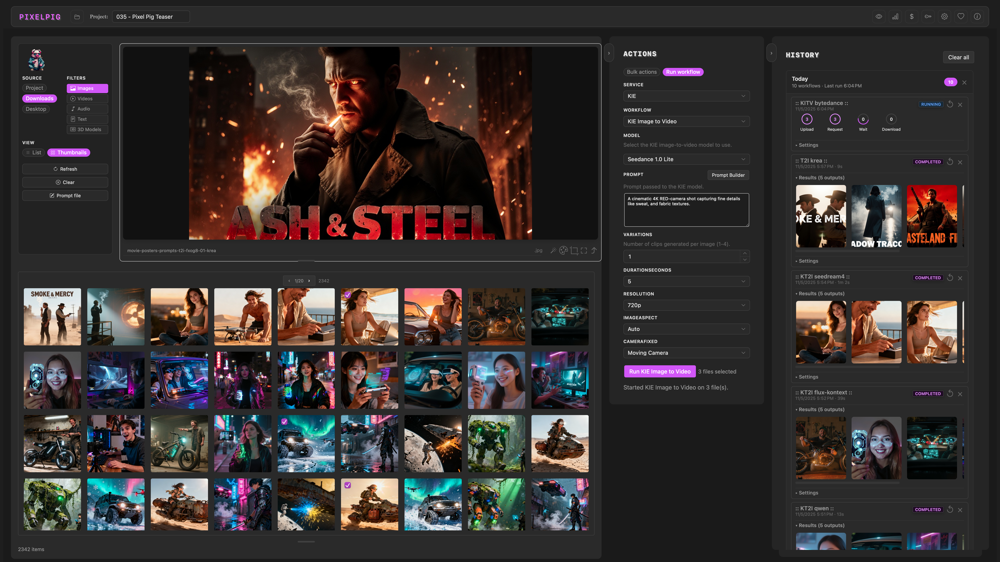

# Pixel Pig  
*A desktop studio for AI workflows*  

## Screenshots  
  

---

## 🎬 What is Pixel Pig?  
Pixel Pig is a standalone desktop app for Windows and macOS that helps you generate, organise, and manage AI-generated assets through a consistent workflow — no matter which API provider you use.  

It supports multiple API aggregators including **Fal**, **Replicate**, and **Kie.ai**, with more added based on community interest.  
Early support is also available for connecting to local **ComfyUI** instances for text-to-image batching and remote connections.  

Pixel Pig supports a wide range of AI workflows for creating and editing images, videos, voice, sound effects, lip-sync, and 3D assets.

Models that rank highly on public leaderboards are included out of the box, and **community model mappings** are supported so you can extend what’s available.

- Simple batch operations — run multiple models and aspect ratios in just a few clicks  
- No manual uploads or downloads — everything’s handled automatically  
- Built-in tools for file viewing, frame extraction, cropping, colour adjustment, format conversion, and batch management  
- Flexible Prompt Builder — customise categories of snippets, save favourites, and tag prompts for quick access  

---

## 🔍 Beta Release – Try It Now  
This repository hosts the **beta builds** of Pixel Pig.  

**[⬇️ Download Pixel Pig](https://addr010.github.io/pixel-pig-releases/)**

Pixel Pig is **donation-ware** — free to use.  
If you or your team are making money with it, consider *sharing the love*.  
Donation links are available inside the app.  

---

## 🛠 Getting Started  
1. **[Download the latest release](https://addr010.github.io/pixel-pig-releases/)** for your platform.  
2. Run the executable (Windows installer) or app bundle (macOS).  
3. Your OS will show a security warning — on Windows click "More info" then "Run anyway", on macOS click "Open" to confirm.  
4. Use it in your workflow and see how it fits.  
5. Found a bug or something odd? [Open an issue](../../issues).  
6. Training and how-to support are available in the [Pixel Pig Skool community](https://www.skool.com/pixel-pig-2056/classroom).  

**🌟 If Pixel Pig saves you time, consider [leaving a star on GitHub](https://github.com/addr010/pixel-pig-releases) — it helps others discover the project.**  

### 🤖 MCP for Local AI Clients

Pixel Pig releases now include a bundled MCP server for local AI tools such as Codex, Claude Desktop, and other MCP-compatible clients.

- If Pixel Pig is already running, connect to `http://127.0.0.1:7361/mcp`
- If your AI client prefers `stdio`, launch:
  - macOS: `/Applications/PixelPig.app/Contents/Resources/app/PixelPig.McpServer --stdio`
  - Windows: `C:\Path\To\PixelPig\PixelPig.McpServer.exe --stdio`
- The app normally starts and stops the MCP sidecar automatically, so manual launch is only needed when your AI client wants to start the server itself.

Detailed setup and troubleshooting: [MCP-SETUP.md](MCP-SETUP.md)

### 🔧 FFmpeg Requirement

Pixel Pig’s audio and video combine features require **FFmpeg** to be installed on your system. These tools will not appear unless FFmpeg is available in your PATH.

To install FFmpeg:

- **macOS**: `brew install ffmpeg`
- **Windows**: `choco install ffmpeg` or download directly from https://ffmpeg.org/download.html

Once installed, restart Pixel Pig — it will automatically detect FFmpeg and enable the relevant tools.

---

## 🎯 Known Issues & Roadmap  

**Known issues**  
- The macOS version currently receives more pre-release testing than the Windows build.  
- The app has not been tested on low-spec machines or older versions of macOS/Windows.  
- Limited model selection on Kie.ai and Replicate. If you urgently need a specific model, please open an issue.  

**What’s next**  
- Custom workflow presets — save and share  
- Pipelines — chain workflows for complex runs in one go  

Nightly builds can be made available if there’s interest.  

---

Thanks for giving Pixel Pig a go — I hope it earns a place in your toolkit.  
